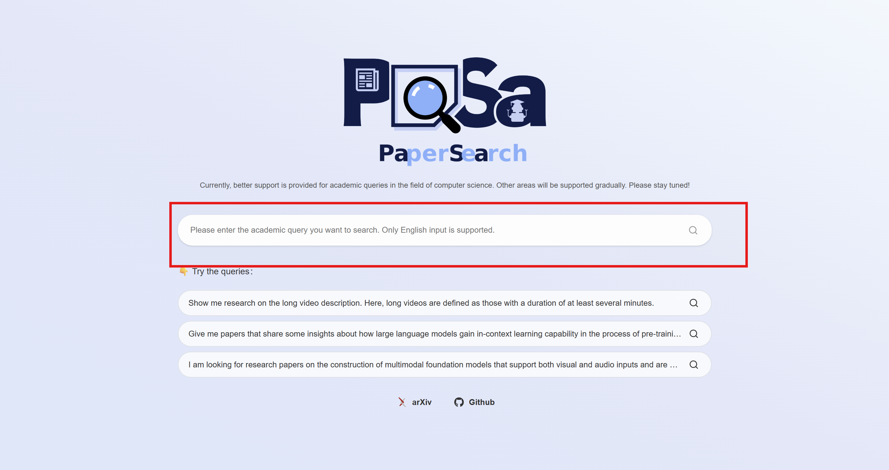
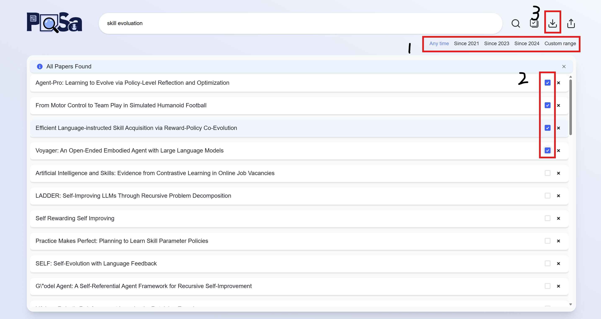

🌐 [English](README.md) | [简体中文](README.zh-CN.md)

---

# paper-dl

**PaSa 与本地 AI 科研工作流之间缺失的最后一环。**

---

## 背景

[PaSa](https://github.com/bytedance/pasa)（字节跳动，ACL 2025）是一个基于大语言模型的学术论文搜索 agent。给定一个研究问题，PaSa 会自动：

1. 生成搜索关键词
2. 爬取 arxiv 并扩展引用网络
3. 用微调的 Selector 模型对每篇论文打相关性分
4. 返回排序后的结果列表——**并导出为 JSON 文件**

**问题在于：** PaSa 的 JSON 只包含元数据——标题、摘要、arxiv 链接和相关性分数，**并不下载论文本身**。

**paper-dl 补全了这一环。** 它读取 PaSa 导出的 JSON，批量下载每篇论文的 PDF，让你拥有一个可以直接喂给 AI agent 进行深度文献分析的本地库。

---

## 环境要求

- Python 3.10 及以上
- 一个外部依赖：[tqdm](https://github.com/tqdm/tqdm)（自动安装）

---

## 安装

```bash
git clone https://github.com/ruizelyu/paper-dl.git
cd paper-dl
pip install -r requirements.txt
pip install .
```

验证安装成功：

```bash
paper-dl --version
# paper-dl 0.1.0
```

---

## 快速上手

### 第一步 — 在 PaSa 上搜索

访问 [pasa-agent.ai](https://pasa-agent.ai)，用英文输入你的研究问题。



> 示例：*"defense methods for LLM agents against prompt injection attacks"*

### 第二步 — 导出 JSON 文件

结果出现后，**① 点击结果面板右上角的下载图标**，将结果保存为 `.json` 文件。下载前可以 **② 勾选或取消**单篇论文。



下载的文件内容如下：

```json
[
  {
    "link": "https://www.arxiv.org/abs/2509.07764",
    "title": "AgentSentinel: An End-to-End and Real-Time Security Defense Framework",
    "publish_time": "20250909",
    "authors": ["Haitao Hu", "Peng Chen"],
    "abstract": "...",
    "score": 0.99
  },
  ...
]
```

将文件保存到电脑上任意位置，例如：

```
~/Downloads/agent_defense.json
```

### 第三步 — 运行 paper-dl

打开终端，运行：

```bash
paper-dl ~/Downloads/agent_defense.json
```

你将看到进度条：

```
Output directory : /Users/you/Downloads/agent_defense
Total papers     : 53
Concurrency      : 3

100%|████████████████████| 53/53 [02:14<00:00,  OK: 51, fail: 2]

Failed list saved to: /Users/you/Downloads/agent_defense/failed.txt

Done.  Success: 51  Skipped: 0  Failed: 2
```

### 第四步 — 找到你的 PDF

paper-dl 会在 **JSON 文件所在的目录**下，创建一个与 **JSON 文件同名的文件夹**：

```
~/Downloads/
├── agent_defense.json                  ← 你从 PaSa 导出的文件（不变）
└── agent_defense/                      ← paper-dl 自动创建
    ├── AgentSentinel_ An End-to-End and Real-Time Security Defense Framework.pdf
    ├── A-MemGuard_ A Proactive Defense Framework for LLM-Based Agent Memory.pdf
    ├── Policy Smoothing for Provably Robust Reinforcement Learning.pdf
    ├── ...
    └── failed.txt                      ← 仅在有下载失败时创建
```

---

## 使用方法

```bash
# 默认：下载到与 JSON 同名的文件夹
paper-dl results.json

# 指定自定义输出目录
paper-dl results.json -o ./my_papers

# 提高并发数加快下载
paper-dl results.json -c 5

# 完整参数
paper-dl results.json -o ./papers -c 3 -r 3
```

**全部参数**

| 参数 | 默认值 | 说明 |
|------|--------|------|
| `json_file` | — | PaSa 导出的 JSON 文件路径 |
| `-o, --output` | 与 JSON 同目录，文件夹名同 JSON 文件名 | PDF 输出目录 |
| `-c, --concurrency` | `3` | 同时下载的论文数 |
| `-r, --retries` | `3` | 每篇论文下载失败后的最大重试次数 |
| `-v, --version` | — | 显示版本号并退出 |

---

## 重复运行

如果对同一个 JSON 文件再次运行 paper-dl，已下载的 PDF 会自动跳过，可以随时安全重跑：

```
Done.  Success: 0  Skipped: 51  Failed: 2
```

---

## 处理下载失败

如果部分论文下载失败，输出目录中会生成 `failed.txt`：

```
https://arxiv.org/abs/2508.02961	Defend LLMs Through Self-Consciousness	HTTP 404
https://arxiv.org/abs/2501.99999	Some Other Paper	max retries exceeded
```

每行包含：`arxiv 链接`、`论文标题`、`失败原因`，以 Tab 分隔。

常见失败原因：
- **HTTP 404** — 该论文尚未在 arxiv 上公开
- **max retries exceeded** — 网络临时故障，重新运行即可

---

## 注意事项

- 仅支持 **arxiv** 论文。PaSa 目前索引 arxiv，所有结果均兼容。
- 默认并发数为 **3**，避免对 arxiv 服务器造成压力，请勿设置过高。

---

## 许可证

MIT © paper-dl contributors
